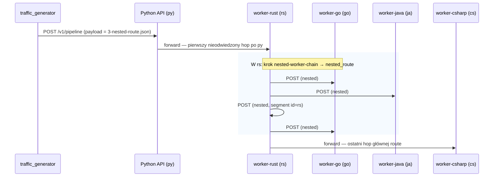

# Architektura HTTP: traffic generator → Python API → workery

Dokument opisuje przepływ żądań demo (`POST /v1/pipeline`), pliki `routes/*` oraz `scenarios/*` w katalogu `stub/sender/python_traffic_generator/`.

## 1. Ruch HTTP — Python API, workery, traffic generator

Gateway (`gateway-python`) to **Python API** (`DEMO_WORKER_ID: py`). Workery to osobne serwisy HTTP z tym samym endpointem `/v1/pipeline`; kolejne hopy to żądania do adresów z `DEMO_PEER_*` w `docker-compose.yml`.

Poniższy diagram odpowiada **konkretnie** plikowi `stub/sender/python_traffic_generator/routes/3-nested-route.json`: główna tablica `route` to **py → rs → cs**, a w segmencie **rs** jeden z kroków `processing_steps` ma pole **`nested_route`** (łańcuch **go → ja → rs → go**). Każda strzałka to osobne żądanie **POST /v1/pipeline** z przekazywanym JSON-em trasy (w praktyce odpowiedzi HTTP wracają synchronicznie przed kolejnym forwardem — na diagramie pominięto zwroty, żeby nie zaciemniać).



Z hosta domyślny cel generatora to zwykle `http://127.0.0.1:18080/v1/pipeline` (port zmapowany na gateway w compose). W sieci Dockera: `http://gateway-python:8080/v1/pipeline`.

---

## 2. Pliki `routes/*` (treść body żądania HTTP)

Wspólny szkielet JSON: tablica **`route`** — kolejność hopów; każdy hop ma **`id`** (`py` | `rs` | `cs` | `go` | `ja`), **`processing_steps`**, opcjonalnie w kroku pole **`nested_route`** (zagnieżdżony łańcuch hopów).

| Plik | Opis |
|------|------|
| `routes/1-route.json` | Trasa **py → rs → cs**, krótkie kroki. |
| `routes/2-slow_route.json` | Ta sama kolejność; na **rs** jeden długi krok (wysoka wartość `time`) — „wolna” ścieżka. |
| `routes/3-nested-route.json` | **py → rs → cs**; na **rs** krok **`nested-worker-chain`** z **`nested_route`**: **go → ja → rs → go** (osobne POST-y zagnieżdżone w obsłudze rs), potem hop do **cs**. |

---

## 3. Pliki `scenarios/*` — jak wysyłane są trasy

Scenariusz definiuje **`groups[]`**: tryb wysyłki, pliki payloadów z katalogu `routes/`, okresowość i powtórzenia.

```mermaid
flowchart LR
  subgraph s1["1-scenario-sequential.json"]
    A1["mode: **sequential**"]
    A2["`payload_files`: **1-route.json**"]
  end

  subgraph s2["2-scenario-parallel.json"]
    B1["grupa 1: **parallel** — wiele plików naraz"]
    B2["grupa 2: **parallel** — **2-slow_route.json**"]
  end

  subgraph s3["3-scenario-nested.json"]
    C1["mode: **sequential**"]
    C2["`payload_files`: **3-nested-route.json**"]
  end

  R1(("routes/<br/>1-route.json"))
  R2(("routes/<br/>2-slow_route.json"))
  R3(("routes/<br/>3-nested-route.json"))

  A1 --> A2 --> R1
  B1 --> R1
  B2 --> R2
  C1 --> C2 --> R3
```

- **`sequential`**: kolejne żądania HTTP jeden po drugim w ramach cyklu grupy.
- **`parallel`**: równoległe **HTTP POST** (generator używa `httpx`).

---

## 4. Powiązane ścieżki w repozytorium

- Implementacje workerów: `workers/` (Python gateway, Rust, C#, Go, Java, opcj. Node.js)
- Generator: `stub/sender/python_traffic_generator/`
- Trasy: `stub/sender/python_traffic_generator/routes/`
- Scenariusze: `stub/sender/python_traffic_generator/scenarios/`
- Compose (gateway + workery): `docker-compose.yml`
