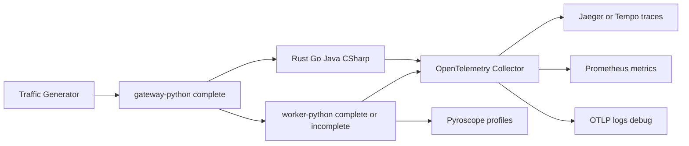

# Python Worker OpenTelemetry Lab

Ten katalog zawiera gotową implementację workera Python oraz wersję ćwiczeniową,
w której pipeline HTTP działa, ale telemetryka została usunięta i zastąpiona
hintami.

## Warianty Kodu

- `workers/python_worker/_src` - wersja complete, gotowa i działająca.
- `workers/python_worker_incomplete/_src` - wersja incomplete dla studentów.
- `workers/python_worker/entrypoint_worker.py` - wybiera wersję przez `PYTHON_WORKER_MODE`.

`gateway-python` zawsze używa wersji complete. Przełączanie dotyczy tylko
serwisu `worker-python`.

## Uruchamianie

Domyślnie uruchamia się wersja complete:

```bash
./compose_run.sh
```

Wersja labowa:

```bash
PYTHON_WORKER_MODE=incomplete ./compose_run.sh
```

Wartości obsługiwane przez entrypoint:

- `complete` - pełna telemetryka.
- `incomplete` - pipeline bez OTel, z miejscami do uzupełnienia.

## Jak Działa Pipeline

Traffic generator wysyła JSON z listą `route`. Każdy worker:

1. Odczytuje pierwszy segment `route`, który nie ma `visited: true`.
2. Sprawdza, czy `id` segmentu pasuje do `DEMO_WORKER_ID`.
3. Wykonuje `processing_steps`, czyli symulowane CPU work.
4. Opcjonalnie uruchamia `nested_route` jako osobny podłańcuch HTTP.
5. Oznacza swój segment jako odwiedzony.
6. Forwarduje payload do następnego workera albo zwraca odpowiedź końcową.

Payload może mieć root-level parametr `http_error_probability`, a każdy obiekt
segmentu `route` może mieć własny lokalny override o tej samej nazwie. Worker
po odebraniu requestu wybiera pierwszy nieodwiedzony segment i używa lokalnej
wartości z tego segmentu, jeśli istnieje; w przeciwnym razie używa wartości
globalnej z root payloadu. Brak pola albo `null` oznacza `0.0`.

Wartość może być liczbą albo stringiem parsowalnym do liczby z zakresu
`0.0..1.0`; wartość spoza zakresu zwraca `HTTP 400`. Każdy mikroserwis losuje
niezależnie tuż po wyborze swojego segmentu, ale przed jakimkolwiek
processingiem lub forwardem. Przy trafieniu zwraca `HTTP 500` z JSON-em
`simulated_http_error`. Dla testu ustaw globalnie np. `0.25`, lokalnie przy
konkretnym segmencie `1.0`, żeby wymusić błąd tylko w tym workerze.



## Co Trzeba Uzupełnić

Pracuj w `workers/python_worker_incomplete/_src`. Zachowanie biznesowe pipeline
ma zostać bez zmian. Uzupełniana jest tylko telemetryka.

### 1. Resource

W `telemetry.py` zbuduj `Resource` z atrybutami:

- `service.name`
- `service.version`
- `service.instance.id`
- `deployment.environment`
- `host.name`
- `demo.worker_id`
- `demo.python.tier`

Te atrybuty pomagają backendom pokazać, z którego serwisu i workera pochodzi
dany span, log albo metryka.

### 2. Traces

W `telemetry.py` skonfiguruj:

- `TracerProvider`
- `OTLPSpanExporter`
- `SimpleSpanProcessor`
- globalny propagator W3C Trace Context

W `pipeline_server.py` hinty pokazują miejsca na:

- span SERVER: `pipeline.hop`
- span INTERNAL: `pipeline.processing`
- spany aktywności z pola `activity`
- span CLIENT: `pipeline.forward`
- span CLIENT: `pipeline.nested_forward`

Najważniejsze przy forwardzie: wyślij nagłówek `traceparent` z aktualnego
spana CLIENT. Bez tego downstream dostaje request HTTP, ale zaczyna nowy trace.
W gotowej wersji atrybut `demo.forward.traceparent` pomaga diagnozować ten
problem.

Przy symulowanym HTTP 500 gotowa wersja oznacza span `pipeline.hop` statusem
error i atrybutami `demo.simulated_http_error=true` oraz
`demo.http_error_probability=<wartość>`. W wersji incomplete przy tym miejscu
jest hint, gdzie dodać status i atrybuty po uzupełnieniu OpenTelemetry.

### 3. Metrics

Dodaj metryki:

- `demo.pipeline.hop.duration_ms` - histogram czasu obsługi hopa.
- `demo.pipeline.messages` - counter przetworzonych wiadomości.
- `demo.process.cpu.utilization` - gauge CPU procesu.
- `demo.process.memory.usage` - gauge pamięci procesu.

Atrybuty punktów metryk powinny zawierać co najmniej:

- `service.name`
- `demo.worker_id`
- `worker_id`

### 4. Logs

`telemetry.log_pipeline_line` w incomplete wypisuje tylko stdout. Uzupełnij:

- `LoggerProvider`
- `OTLPLogExporter`
- `BatchLogRecordProcessor`
- `LoggingHandler`

Po tym logi aplikacyjne będą wysyłane do OpenTelemetry Collectora.

### 5. Pyroscope

Pyroscope jest osobnym kanałem danych, niezależnym od OTel traces/metrics.
Uzupełnij `init_pyroscope_push()` tak, żeby przy ustawionym `PYROSCOPE_SERVER`
uruchamiał profiler CPU z tagami `service.name`, `demo.worker_id` i
`deployment.environment`.

## Gdzie Sprawdzać Efekty

- Jaeger / Tempo: czy cały pipeline jest jednym trace ID.
- Jaeger span details: atrybuty `demo.*`, `http.url`, status downstream.
- Prometheus / Grafana: metryki `demo.pipeline.*` i `demo.process.*`.
- Logi Collectora: logi OTLP i debug exporter.
- Pyroscope: profile CPU per `service.name`.

## Typowe Objawy Błędów

- Tylko `gateway_python` w trace: pierwszy forward nie wysłał poprawnego
  `traceparent`.
- Downstream istnieje jako osobny trace: propagacja kontekstu działa źle na
  granicy HTTP.
- `worker-python` nie pojawia się w trace: sprawdź, czy route zawiera
  `py-worker` oraz czy peer map ma `DEMO_PEER_PY-WORKER`.
- Losowe `HTTP 500`: sprawdź globalne i lokalne `http_error_probability` w
  route payloadzie; lokalny parametr w segmencie ma pierwszeństwo przed globalnym.
- Brak metryk: sprawdź `MeterProvider`, exporter i atrybuty punktów.
- Brak logów: sprawdź `OTEL_DEMO_LOG_EXPORT`, `LoggerProvider` i endpoint
  `OTEL_EXPORTER_OTLP_LOGS_ENDPOINT`.
# `python_worker` — wspólna biblioteka (OTel + HTTP pipeline)

- **`_src/telemetry.py`** — inicjalizacja eksportu (OTLP, logi, Pyroscope, metryki procesu).
- **`_src/pipeline_server.py`** — serwer `POST /v1/pipeline`, spany aplikacyjne; W3C `traceparent` przy forwardzie: jawny `TraceContextTextMapPropagator` + `Request.add_header` (nie `inject` z globalnego API ani sam słownik w konstruktorze `Request`). Diagnostyka: `DEMO_OTEL_FORWARD_DEBUG=true` w env kontenera — loguje prefix `traceparent`.

## Obraz Dockera `python_worker_lib`

Kontekst buildu to katalog **`workers/`** (skrypt ustawia `cd ..` z `python_worker/`).

```bash
./docker_build.sh
```

W obrazie są **oba** warianty kodu:

| Ścieżka w kontenerze | Źródło |
|----------------------|--------|
| `/app/modes/complete` | `python_worker/_src` |
| `/app/modes/incomplete` | `python_worker_incomplete/_src` |

Który wariant kodu ładuje **worker** (`py-worker`), wybiera **`PYTHON_WORKER_MODE`** (`complete` | `incomplete`) — domyślnie przez eksport w `./compose_run.sh` (wartość w `docker-compose.yml` przy `worker-python`). Bramka `gateway-python` ma zawsze pełny kod (`complete`); obsługa ścieżek w `python_gateway/main.py`.

Obraz **`gateway-python`** (`worker_python`) rozszerza `python_worker_lib` — zob. `python_gateway/Dockerfile`. Przed `docker compose build gateway-python` musi istnieć tag `python_worker_lib` (np. krok w `compose_build.sh`).
